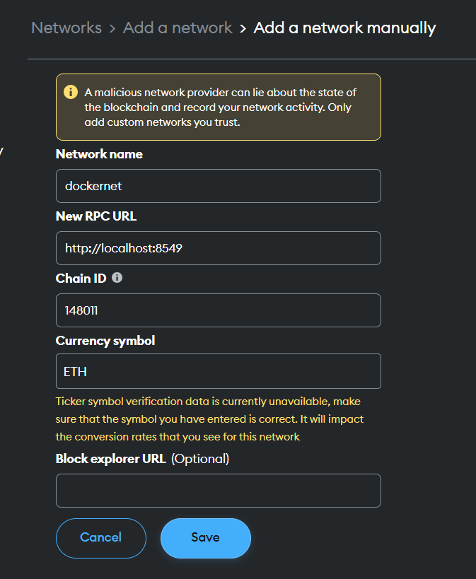
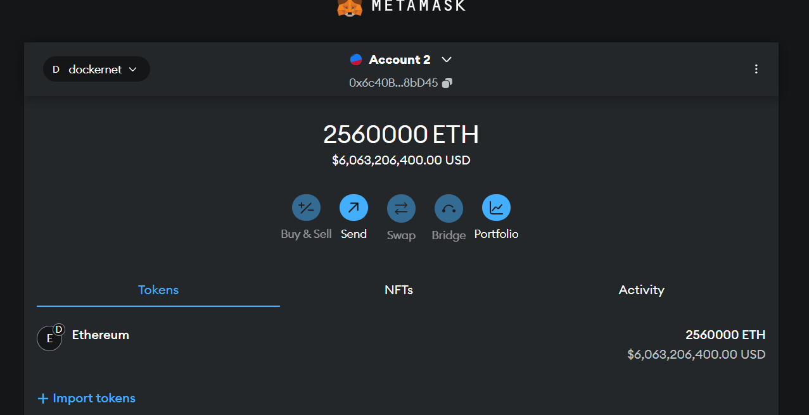

# Proof of Stake Multiple Node Network Deployment

This project sets up a **multi-node private Ethereum network** using **Docker Compose**. It is designed for development and testing purposes, providing an easy way to deploy and interact with a Proof-of-Stake (PoS) Ethereum network in a local environment.

## Table of Contents

- [Requirements](#requirements)
- [Installation](#installation)
- [Usage](#usage)
- [Features](#features)

## Requirements

Before you begin, ensure you have the following installed:

- [Docker](https://docs.docker.com/get-docker/)
- [Docker Compose](https://docs.docker.com/compose/install/)

## Installation

1. Clone the repository:
   ```bash
   git clone https://github.com/rymksotnini/POS-multiple-node-deployment.git
   ```

2. Generate the bootnode of the Docker-based Ethereum network:
   ```bash
   cd scripts
   ./generate_bootnode.sh

   Your Bootnode ID is:
    <BootnodeID>
    Your bootnode enode URL is (replace <YOUR_BOOTNODE_IP> with the actual IP):
    enode://<BootnodeID>@bootnode:30301
    Bootnode information has been saved to .env file.
   ```

3. Start the Docker-based Ethereum network:
   ```bash
   cd ..
   ./start-docker.sh
   ```

This script launches a multi-node Ethereum network by setting up Docker containers for both execution (Geth) and consensus (Beacon) layers, connecting the nodes, and ensuring proper network configuration and operation.

### Breakdown of `start-docker.sh`:

#### Clean Script Execution:
```bash
./clean.sh
```
This cleans up the Docker environment by removing any existing containers related to the Ethereum network and clearing out old validator data. It also deletes temporary and backup configuration files, ensuring everything is reset and ready for a fresh setup.

After `./clean.sh` has been run, you should see this:
```bash
Removing validator-specific data... etc
Removing data from ../config/validator_*/consensus/beacondata... etc
```
#### Check Configuration:
```bash
./check_config.sh
```
This checks if the necessary directories and files for Ethereum validators exist and are not empty. If any are missing or empty, it triggers the generate_config.sh script to create the required configurations.

After `../check_config.sh` has been run, you should see this:
```bash
generating config
```
#### Generate Configuration:
```bash
./generate_config.sh
```
This script generates the necessary configuration for Ethereum validators when it doesn't exist. It creates keystores, private keys, and JWT tokens for each validator using a seed value to ensure consistent key generation. It also generates beacon node keys for the consensus layer. The script sets up the directory structure and permissions needed for validators to participate in the network. This ensures the validators are properly configured for running the Ethereum network.
```bash
Generating keystore for validator 1
Generating password.txt for validator 1
Creating account using the generated private key
Private key: <Private_key>
INFO [] Maximum peer count                       ETH=50 total=50
Address: {<address>}
Generating JWT token for validator 1
Generating keystore for validator 2
Generating password.txt for validator 2
Creating account using the generated private key
Private key: <Private_key>
INFO [] Maximum peer count                       ETH=50 total=50
Address: {<address>}
Generating JWT token for validator 2
Generating keystore for validator 3
Generating password.txt for validator 3
Creating account using the generated private key
Private key: <Private_key>
INFO [] Maximum peer count                       ETH=50 total=50
Address: {<address>}
Generating JWT token for validator 3
Beacon key generated for validator 1: <Key>
Beacon key generated for validator 2: <Key>
Beacon key generated for validator 3: <Key>
```
#### Generate Genesis File:
```bash
./generate_genesis.sh
```
This script generates the required genesis files and configurations for an Ethereum Proof-of-Stake (PoS) network. It sets up each validator's execution and consensus layers by creating genesis files and assigning account balances.

```bash
Generate genesis file
Loaded 0xAddress for validator 1: <Address1>
Loaded 0xAddress for validator 2: <Address2>
Loaded 0xAddress for validator 3: <Address3>
All loaded 0xAddresses:
<Address1>
<Address2>
<Address3>
Genesis file generated at <project_location>/scripts/../templates/execution_template/tmp-genesis.json
time="" level=info msg="Specified a chain config file: /consensus_template/config.yml" prefix=genesis
time="" level=info msg="No genesis time specified, defaulting to now()" prefix=genesis
time="" level=info msg="Delaying genesis 1725551187 by 300 seconds" prefix=genesis
time="" level=info msg="Genesis is now 1725551487" prefix=genesis
time="" level=info msg="Setting fork geth times" cancun=1725551487 prague=8925551487 prefix=genesis shanghai=1725551487
time="" level=info msg="Done writing genesis state to /consensus_template/tmp-genesis.ssz" prefix=genesis
time="" level=info msg="Command completed" prefix=genesis
Beacon chain genesis created and output at <project_location>/scripts/../templates/consensus_template/tmp-genesis.ssz
Copy Genesis file generated at <project_location>/scripts/../templates/execution_template/tmp-genesis.json
```

#### Start Bootnode:
```bash
docker compose up -d bootnode
```
This command starts the bootnode container in the background. The bootnode is responsible for enabling the other nodes to discover and communicate with each other.

```bash
start for bootnode
✔ Network ethereum-net  Created                                                               0.1s
 ✔ Container bootnode-1  Started                                                               0.7s
```
#### Start and Initialize Geth Nodes:
```bash
docker compose up -d geth1-init geth2-init geth3-init
```
This command initializes the Geth nodes (`geth1`, `geth2`, `geth3`) by starting their Docker containers in the background.
```bash
[+] Running 7/7
 ✔ Network default              Created                                                        0.1s
 ✔ Container geth3-remove-db-1  Exited                                                         1.9s
 ✔ Container geth1-remove-db-1  Exited                                                         1.7s
 ✔ Container geth2-remove-db-1  Exited                                                         2.0s
 ✔ Container geth3-init-1       Started                                                        2.4s
 ✔ Container geth2-init-1       Started                                                        2.7s
 ✔ Container geth1-init-1       Started                                                        2.2s
```
#### Start Ethereum POS nodes:
```bash
docker compose up geth1 geth2 geth3 beacon1 beacon2 beacon3 validator1 validator2 validator3 -d
```
This starts all Ethereum execution (`geth1`, `geth2`, `geth3`) and consensus (Beacon chain) nodes (`beacon1`, `beacon2`, `beacon3`), as well as validators, in detached mode. These nodes will interact with each other as part of the private PoS Ethereum network.

```bash
Start Ethereum POS nodes 
[+] Running 9/9
 ✔ Container geth3-1       Started                                                             1.1s
 ✔ Container geth1-1       Started                                                             1.2s
 ✔ Container geth2-1       Started                                                             1.2s
 ✔ Container beacon3-1     Started                                                             1.6s
 ✔ Container beacon1-1     Started                                                             1.9s
 ✔ Container beacon2-1     Started                                                             1.9s
 ✔ Container validator3-1  Started                                                             2.4s
 ✔ Container validator1-1  Started                                                             2.7s
 ✔ Container validator2-1  Started                                                             2.7s
```

#### Update Geth Cluster:
```bash
./update_geth_cluster.sh
```
This script sets up peer connections between Geth nodes in a Docker-based Ethereum network. It retrieves node addresses, links the nodes as peers, and checks the connections.

```bash
update cluster geth, connect execution nodes together - does admin peer add
Enode for geth1: enode://<address>@geth1:30303
Enode for geth2: enode://<address>@geth2:30304
Enode for geth3: enode://<address>@geth3:30305?discport=0
Adding peers to geth1
Adding peers to geth2
Adding peers to geth3
Peer addition completed.
Checking Execution/ geth peers for geth1-1:
[{
    caps: ["eth/68", "snap/1"],
    enode: "enode://...",
    id: "...",
    name: "...",
    network: {
      inbound: false,
      localAddress: "...",
      remoteAddress: "...",
      static: true,
      trusted: false
    },
    protocols: {
      eth: {
        version: 68
      },
      snap: {
        version: 1
      }
    }
}]
Checking Execution/ geth peers for geth2-1:
[{
    caps: ["eth/68", "snap/1"],
    enode: "enode://...",
    id: "...",
    name: "...",
    network: {
      inbound: "...",
      localAddress: "...",
      remoteAddress: "...",
      static: true,
      trusted: false
    },
    protocols: {
      eth: {
        version: 68
      },
      snap: {
        version: 1
      }
    }
}]
Checking Execution/ geth peers for geth3-1:
[{
    caps: ["eth/68", "snap/1"],
    enode: "enode://...",
    id: "...",
    name: "...",
    network: {
      inbound: "...",
      localAddress: "...",
      remoteAddress: "...",
      static: false,
      trusted: false
    },
    protocols: {
      eth: {
        version: 68
      },
      snap: {
        version: 1
      }
    }
}, {
    caps: ["eth/68", "snap/1"],
    enode: "enode://...",
    id: "...",
    name: "...",
    network: {
      inbound: "...",
      localAddress: "...",
      remoteAddress: "...",
      static: false,
      trusted: false
    },
    protocols: {
      eth: {
        version: 68
      },
      snap: {
        version: 1
      }
    }
}]
Execution Peer check completed.
```

#### Update Beacon Cluster:
```bash
./update_beacon_cluster.sh
```
This script updates the peer connections for Prysm beacon nodes in a Docker-based Ethereum network. It retrieves the P2P addresses for the beacon nodes, modifies the Docker Compose file to include the updated connections, and restarts the nodes to apply the changes. After restarting, it checks the peer count to confirm successful connectivity between the nodes.
```bash
update beacon geth, connect consensus nodes together, and restart - update the docker compose and restarts
Gathering P2P addresses from beacon nodes
P2P address for beacon1: /ip4/...
P2P address for beacon2: /ip4/...
P2P address for beacon3: /ip4/...
Updating Docker Compose file for beacon1...
Updating Docker Compose file for beacon2...
Updating Docker Compose file for beacon3...
Docker Compose file updated.
Restarting beacon nodes...
[+] Running 3/3
 ✔ Container beacon2-1  Started                                                                1.9s
 ✔ Container beacon3-1  Started                                                                1.9s
 ✔ Container beacon1-1  Started                                                                1.8s
All beacon nodes updated and restarted.
wait 30 secs for restart to check beacon peers
Checking peer count for beacon1-1:
{
  "data": {
    "disconnected": "0",
    "connecting": "0",
    "connected": "2",
    "disconnecting": "0"
  }
}
Checking peer count for beacon2-1:
{
  "data": {
    "disconnected": "0",
    "connecting": "0",
    "connected": "2",
    "disconnecting": "0"
  }
}
Checking peer count for beacon3-1:
{
  "data": {
    "disconnected": "0",
    "connecting": "0",
    "connected": "2",
    "disconnecting": "0"
  }
}
Peer check completed.
```

## Usage
### 1. Allocate ETH to Your Accounts
Before interacting with the network, ensure your accounts have enough ETH. To fund your preferred accounts (e.g., `0x08DF7B065dA34C7a59fD232aA90Eb0129F0465A5`), update the `genesis_template.json` file with the following steps:

1. Open the genesis file located at `templates/execution_template/genesis_template.json`.
2. Add your account address and allocate ETH to it:

    ```json
    {
      ...
      "alloc": {
        "08DF7B065dA34C7a59fD232aA90Eb0129F0465A5": {
          "balance": "0x43c33c1937564800000"  // This value represents the amount of ETH in wei
        },
        ...
      }
      ...
    }
    ```

### 2. Reset the network to Apply Changes
After updating the `genesis_template.json` file, reset the network to apply the changes by rerunning `start-docker.sh`

```bash
./start-docker.sh
```

This will reset the network and apply the new configuration.

### 3. Connect to the Network with MetaMask
Once the network is up and running, you can connect to it using MetaMask:
1. Set up a new custom RPC network in MetaMask using your network details.


2. Import the account you funded in the `genesis_template.json` file by using the corresponding private key.


### 4. Testing the Network with Hardhat
Now that your network is running, you can deploy and interact with smart contracts using Hardhat.

#### Example Hardhat Configuration:
Create a `hardhat.config.ts` file with the following configuration:

```typescript
import dotenv from 'dotenv';
dotenv.config();
import type { HardhatUserConfig } from "hardhat/config";
import "@nomicfoundation/hardhat-toolbox-viem";

const config: HardhatUserConfig = {
  solidity: "0.8.24",
  networks: {
    dockernet: {
      url: "http://localhost:8549",
      chainId: 148011,
      accounts: [
        process.env.PKEY!
      ],
    },
  },
};

export default config;
```

#### Smart Contract Example:
Here’s a simple smart contract for demonstration:

```typescript
// contracts/Lock.sol
// SPDX-License-Identifier: MIT
pragma solidity ^0.8.0;

contract Lock {
    uint public unlockTime;
    address payable public owner;

    event Withdrawal(uint amount, uint when);

    constructor(uint _unlockTime) payable {

        unlockTime = _unlockTime;
        owner = payable(msg.sender);
    }

    function withdraw() public {
        require(block.timestamp >= unlockTime, "You can't withdraw yet");
        require(msg.sender == owner, "You aren't the owner");

        emit Withdrawal(address(this).balance, block.timestamp);

        owner.transfer(address(this).balance);
    }
}
```

#### Deployment Script:
Create an ignition script `lock.ts` script to deploy the smart contract:

```typescript
import { buildModule } from "@nomicfoundation/hardhat-ignition/modules";
import { parseEther } from "viem";

const JAN_1ST_2030 = 1893456000;
// January 1st, 2020 (a date in the past)
const JAN_1ST_2020 = 1577836800;

const ONE_GWEI: bigint = parseEther("0.001");

const LockModule = buildModule("LockModule", (m) => {
  const unlockTime = m.getParameter("unlockTime", JAN_1ST_2020);
  const lockedAmount = m.getParameter("lockedAmount", ONE_GWEI);

  const lock = m.contract("Lock", [unlockTime], {
    value: lockedAmount,
  });

  return { lock };
});

export default LockModule;

```

### 5. Deploying and Interacting with the Smart Contract
To deploy the contract and interact with the network, run the following commands:

```bash
npx hardhat ignition deploy ./ignition/modules/Lock.ts --network dockernet

✔ Confirm deploy to network dockernet (148011)? … yes

Hardhat Ignition 🚀

Deploying [ LockModule ]

Batch #1
  Executed LockModule#Lock

[ LockModule ] successfully deployed 🚀

Deployed Addresses

LockModule#Lock - 0xc556190aFb564EC86Ce52467007a1E895ddA4D16
```

Once deployed, you can use MetaMask or Hardhat scripts to interact with the contract, such as calling the `withdraw` function after the unlock time.

In this example, we created a `withdraw.js` script:
```javascript
const hre = require("hardhat");
const { createPublicClient, createWalletClient, http, parseAbi } = require('viem');
const { privateKeyToAccount } = require('viem/accounts');

async function main() {
  console.log(`Withdrawing on network: ${hre.network.name}`);

  const abi = parseAbi(['function withdraw() public']);
  const contractAddress = "0xa72BC75076B88b5f22bFdA94E8b3514c6A104020";
  const rpcUrl = hre.network.config.url;
  const chainId = hre.network.config.chainId;

  const publicClient = createPublicClient({ chain: { id: chainId, rpcUrls: { default: { http: [rpcUrl] } } }, transport: http() });
  const privateKey = hre.network.config.accounts[0];
  const account = privateKeyToAccount(privateKey.startsWith('0x') ? privateKey : `0x${privateKey}`);

  const walletClient = createWalletClient({ account, chain: { id: chainId, rpcUrls: { default: { http: [rpcUrl] } } }, transport: http() });

  try {
    const hash = await walletClient.writeContract({ address: contractAddress, abi, functionName: 'withdraw' });
    console.log("Withdrawal transaction sent! Hash:", hash);

    const receipt = await publicClient.waitForTransactionReceipt({ hash });
    console.log("Withdrawal successful! Block number:", receipt.blockNumber);
  } catch (error) {
    console.error("Error during withdrawal:", error.message);
  }
}

main().then(() => process.exit(0)).catch((error) => {
  console.error(error);
  process.exit(1);
});
```
Run the following command to execute the script in the dockernet network:
```bash
npx hardhat run scripts/withdraw.js --network dockernet

Withdrawing on network: dockernet
Withdrawal transaction sent!
Transaction hash: 0x31dd90777d02a398f310ab76ada3b43d0c558338c3464cc585f7d410e1ef78f4
Withdrawal successful!
Block number: 521n
```

---

## Features

- **Multi-node PoS Network:** Simulates multiple Ethereum nodes, including validators, using Proof-of-Stake consensus.
- **Easy Setup with Docker Compose:** Using Docker Compose ensures that all required services are containerized, providing a clean and easily reproducible environment.
- **Preconfigured Genesis File:** Supports adding funds to specific accounts and deploying contracts directly from the genesis block.
